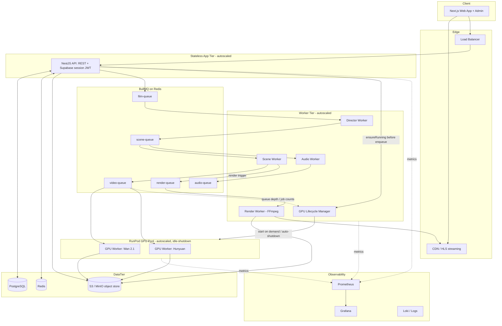
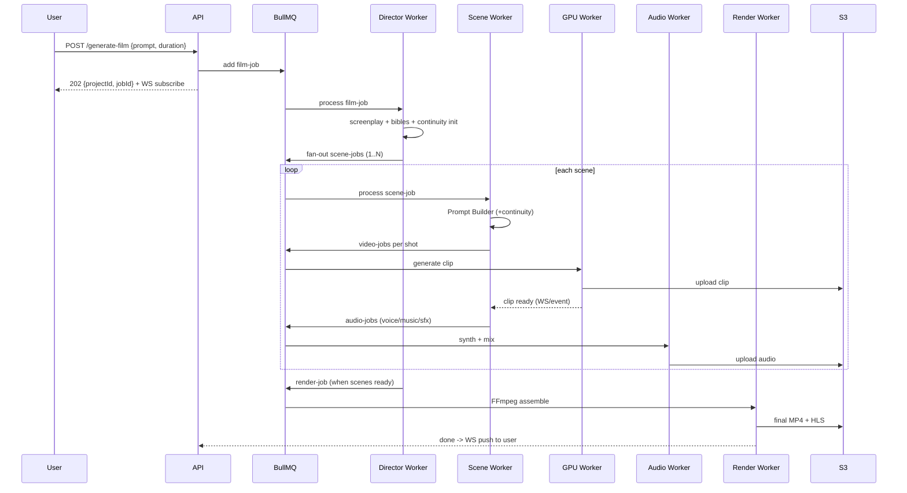
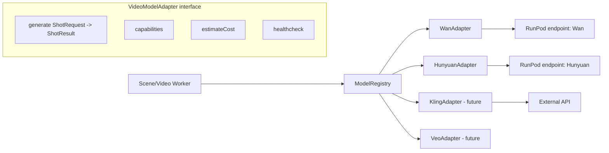
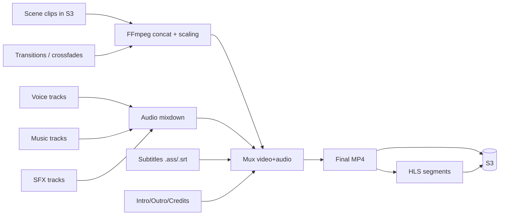
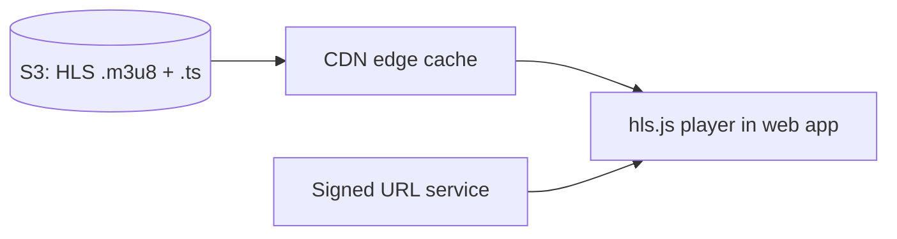
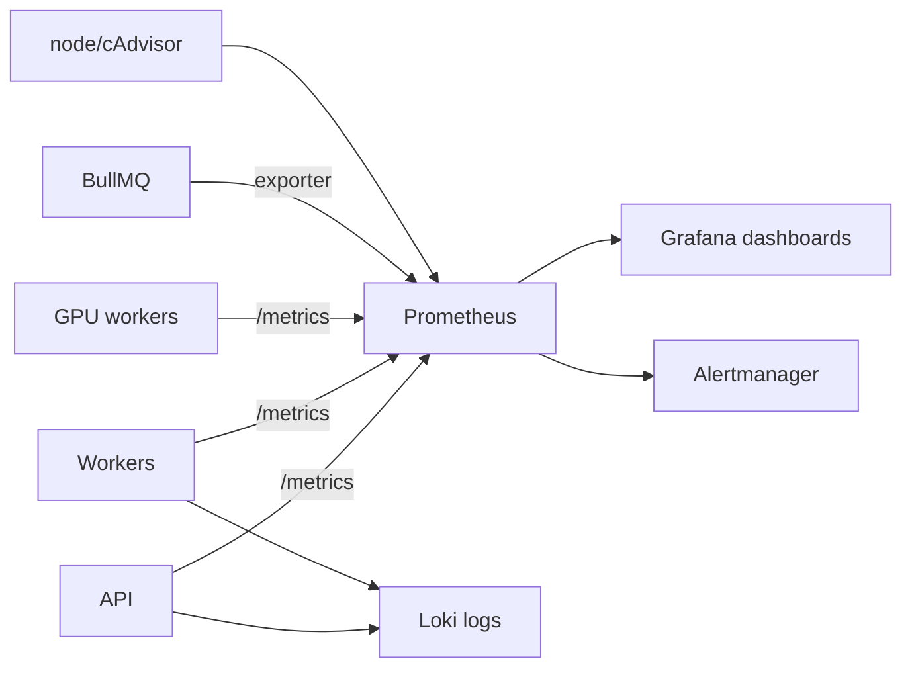

# 01 — System Architecture

All diagrams are Mermaid (render on GitHub).

> **Status (2026-10-09):** these diagrams are the original target. There is no
> WebSocket layer: the Socket.IO gateway and `packages/realtime` were deleted.
> The web app writes and reads Supabase directly and gets live status from
> Supabase Realtime on `projects`; the worker's project poller picks up new
> projects. `apps/api` authenticates Supabase session tokens and is deployable
> but not deployed (docs/04).

## 1. High-level system

## 2. Request → film lifecycle

## 3. Model abstraction layer

The frontend and the scene pipeline only know the **`VideoModelAdapter`
interface** and a model `id` string. Adding a model = add an adapter +
register it. No frontend change. See `packages/model-adapters`.

## 4. Rendering pipeline

## 5. Streaming pipeline

- Final MP4 is also transcoded to HLS (multiple bitrates) for adaptive
  streaming. Download uses short-lived presigned S3 URLs.

## 6. Monitoring pipeline

## 7. Scaling strategy (summary)

| Layer | Scaling mechanism |
|-------|-------------------|
| Web | Stateless, CDN-fronted, horizontal replicas |
| API | Stateless, HPA on CPU/RPS, sticky-free (JWT) |
| Live updates | Supabase Realtime (Postgres Changes, RLS-scoped); no WebSocket tier |
| Workers | Per-queue replica count, concurrency tuning, BullMQ priorities |
| GPU | RunPod autoscale by queue depth, idle shutdown, per-model pools |
| Postgres | Read replicas, PgBouncer pooling, partition large tables |
| Redis | Cluster mode for queue + cache separation |
| Storage | S3 native scaling, CDN for reads |

Full detail in [19-scaling-cost.md](19-scaling-cost.md).

## 8. Deployment strategy (summary)

- **Local:** docker-compose (pg, redis, minio) + `pnpm dev`.
- **Staging/Prod:** Kubernetes (Helm). App & workers as Deployments with HPA;
  GPU workers on RunPod (serverless endpoints + on-demand pods) decoupled via
  queue. CI/CD via GitHub Actions → registry → Helm upgrade.

Full detail in [20-deployment-plan.md](20-deployment-plan.md).
