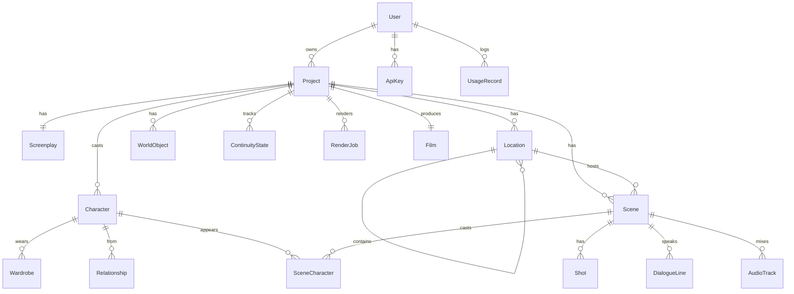

# 02 — Database Schema

The authoritative schema is [`packages/db/prisma/schema.prisma`](../packages/db/prisma/schema.prisma).
This document is the narrative + ERD.

## ERD



## Design notes

### Continuity is first-class
`ContinuityState` stores a **snapshot of canonical world truth per scene
index** as JSON: which wardrobe each character wears, injuries/mood, world
changes (a burned village stays burned), and story flags. The Prompt Builder
reads `state at scene N` so generation never contradicts earlier scenes. The
Continuity Engine writes a new snapshot as each scene resolves (diff-based).

### Bibles are reusable and referenced, never inlined
`Character.appearance` / `Location.description` are the **single canonical
descriptions**. Scenes reference characters and locations by FK; the prompt
builder composes the final prompt from the bible + continuity, so a character's
look cannot drift between scenes. `referenceUrls` hold S3 keys for reference
images (IP-Adapter / identity conditioning) and `embedding` holds an identity
embedding for consistency scoring in QC.

### Wardrobe has validity windows
`Wardrobe.validFromScene/validToScene` lets continuity resolve "the king wears
armor from the battle (scene 40) onward". `SceneCharacter.wardrobeId` is the
**resolved** outfit for that specific scene.

### Shots are the atomic generation unit
A `Scene` decomposes into ordered `Shot`s. Each shot has a final `prompt`,
`cameraPlan` (size/movement/angle/lens), a fixed `seed` (reproducibility),
`gpuMs` (billing), and a `qcScore`. Regeneration bumps `attempts`.

### Billing in GPU-milliseconds
`User.creditsMs` and `UsageRecord.gpuMs` track the real cost driver (GPU time),
decoupled from wall-clock price changes. `costUsd` is computed at log time.

## Key indexes

| Table | Index | Why |
|-------|-------|-----|
| Project | (userId, status) | dashboard lists, status filters |
| Scene | (projectId, status), unique (projectId,index) | ordered pipeline scans |
| Shot | (status), unique (sceneId,index) | worker claims pending shots |
| ContinuityState | unique (projectId,sceneIndex) | O(1) "state at N" lookup |
| UsageRecord | (userId, createdAt) | quota windows, billing rollups |

## Partitioning at scale
For 1M users, partition high-volume tables by time/project:
- `Shot`, `AudioTrack`, `UsageRecord` → range/hash partition.
- Archive `READY` projects' shots to cold storage; keep `Film` hot.

## Phase 3 additions (docs/24)
Additive, non-breaking: `Series` / `Season` / `Episode` (episodic hierarchy,
`Scene.episodeId?`), `StoryEvent` (append-only canon log — source of truth for
continuity/world state), provenance + cache fields on `Shot`
(`modelVersion`, `promptHash`, `cacheKey` + index), `Character.loraKey/loraVersion`
(per-character LoRA), and `Film.version` (canon/edit versioning). Single films are
unchanged; series populate the new hierarchy.

## Migrations
```bash
pnpm --filter @cineforge/db prisma migrate dev --name init
pnpm --filter @cineforge/db prisma generate
```
