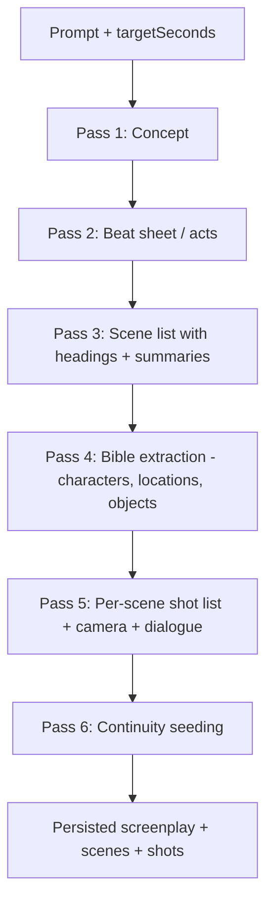

> **Current implementation:** the Director runs as described in [docs/45](45-directoros-intelligence.md) (DirectorOS W2: one master call → Film IR → validator → Production Compiler). This document is the earlier design.

# 05 — Director AI

The Director AI is the film producer. It turns one prompt into a fully
structured, production-ready plan and orchestrates the pipeline.

## Responsibilities
1. **Screenplay generation** — logline, synopsis, acts, scenes, dialogue.
2. **Character & location extraction** — populate the Character/World Bibles.
3. **Scene planning** — break the story into N scenes sized to hit the target
   duration.
4. **Shot planning** — decompose each scene into shots with camera direction.
5. **Continuity enforcement** — initialize and constrain continuity state.
6. **Cinematic direction** — genre, tone, pacing, color, music cues.

## How duration maps to structure
Target seconds → scene/shot budget (deterministic, then LLM fills content):

```
targetSeconds = 1800 (30 min)
avgSceneSec   = 18           # tunable per genre/pacing
=> scenes     ≈ 100
avgShotSec    = 5            # model clip length (Wan 2.1 ~5s)
shotsPerScene ≈ ceil(avgSceneSec / avgShotSec) = 4
=> shots      ≈ 400
```

So "a 30-minute historical movie" → ~100 scenes, ~400 shots, each a production
unit. The Director emits `Scene 1 … Scene 100` with complete instructions.

## Pipeline stages (multi-pass LLM)

> **Status (2026-10-09):** not built as described. The Director makes **one**
> master planning call that returns the Film IR, validated by a zod validator
> chain (schema, references, story, canon, cinema, production, budget) with at most **one** surgical
> revision call (`packages/movie/src/intelligence/planner.ts`,
> `packages/movie/src/ir/validate.ts`; [docs/45](45-directoros-intelligence.md)).



Multi-pass keeps each LLM call small and structured (avoids one giant
unreliable generation) and lets long films stream scene-by-scene to the queue
as soon as the scene list exists.

## LLM provider
Uses Claude (Anthropic API) as the reasoning model for planning. The client
was planned for `apps/api/src/director/llm.ts`; it is actually the model router in
`packages/movie/src/intelligence/` (Anthropic and OpenAI providers). Default model: latest Claude (see
`docs/claude-api` guidance / repo skill). Structured output is enforced with
**tool/JSON schemas** so every pass returns validated objects.

> When wiring the LLM client, consult the `claude-api` skill for current model
> ids, structured-output (tool use), and prompt-caching guidance — do not
> hardcode model ids from memory.

## Output contracts (zod, in `packages/shared`)

> **Status (2026-10-09):** the `ScenePlan` below was never built. The real
> contract is the Film IR zod schema in `packages/movie/src/ir/schema.ts`,
> checked by `validateFilmPackage` in `packages/movie/src/ir/validate.ts` (docs/45).

```ts
// Scene as produced by the Director
const ScenePlan = z.object({
  index: z.number().int(),
  heading: z.string(),                  // "EXT. SAVANNA - DAWN"
  summary: z.string(),
  locationRef: z.string(),              // World Bible name/id
  timeOfDay: z.string().optional(),
  weather: z.string().optional(),
  characterRefs: z.array(z.string()),   // Character Bible names/ids
  dialogue: z.array(z.object({
    character: z.string().nullable(),
    text: z.string(),
    emotion: z.string().optional(),
  })),
  shots: z.array(z.object({
    index: z.number().int(),
    description: z.string(),
    shotSize: z.enum(["EWS","WS","MS","MCU","CU","ECU"]),
    movement: z.enum(["static","pan","tilt","dolly","crane","handheld","drone"]),
    angle: z.enum(["eye","low","high","dutch","overhead"]),
    lens: z.string().optional(),        // "35mm", "anamorphic"
    durationSec: z.number(),
  })),
});
```

## Camera planning
Each shot carries a `cameraPlan` (size/movement/angle/lens). The Prompt Builder
([09](09-scene-pipeline.md)) translates this into model-specific prompt tokens
and motion strength, so cinematic intent survives into generation.

## Orchestration (worker)
`film.processor.ts` runs the Director, persists screenplay + bibles, then uses
a **BullMQ flow** to fan out one `scene-job` per scene with a parent
`render-job` that waits for all children ([13](13-queues.md)).

## Implementation checklist
- [ ] LLM client with retry + JSON-schema validation
- [ ] 6-pass prompt templates + caching of system/context
- [ ] Duration→structure planner (configurable per genre)
- [ ] Persist + emit `project.progress` per pass (no WS event exists; progress is written to `projects` and seen via Supabase Realtime)
- [ ] Idempotency: re-running a pass is safe (upsert by index)

## Status — Anthropic Director wired

The content planner is now backed by **Anthropic Claude** (default
`claude-opus-4-8`, override `ANTHROPIC_MODEL`); set `ANTHROPIC_API_KEY` to
enable it. It produces a structured plan — logline, synopsis, genre/tone, a
visually-consistent protagonist (appearance, age, gender, personality), a
primary location (with `kind`), and a beat-by-beat scene list — persisted to the
Character/World Bible, `screenplays`, `scenes` and `shots`.

Because each shot's `prompt` is composed from this bible + scene beat, the shot
prompts are **bible-aware**, and any seed frame generated from a shot prompt
(`OpenAIImageAdapter`, docs/22) inherits the same look — keeping the AI seed in
line with the Director.

**Status (2026-10-09):** there is no silent stub fallback any more. If the plan
cannot be produced or fails validation after its one revision, the production
fails with a reason; the deterministic stub (`apps/worker/src/director/stub.ts`)
is used only when no planning provider is configured **and**
`DIRECTOR_ALLOW_STUB=1`.

Implementation: `packages/movie/src/intelligence/planner.ts` (master call +
revision), `packages/movie/src/ir/validate.ts` (validator chain) and
`apps/worker/src/director/director.service.ts` (persistence + prompt
composition). There is no `apps/worker/src/director/llm.ts`.
