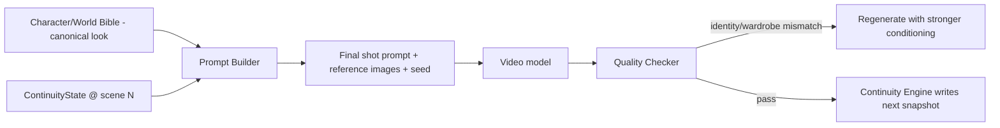

# 06 — Continuity Engine

> **This is the original design spec.** The shipped implementation — the pure
> fold engine, Scene Bridges, continuity score, auto-fill, and the visual
> identity stack (asset id → reference frames → LoRA) — is documented in
> [28 — Continuity Engine (implemented)](28-continuity-engine.md).
>
> **DirectorOS W3 (2026-10-08):** Film IR projects now use the typed, id-keyed
> World State Engine and the Character Continuity Engine — see
> [46 — Canon, world state and continuity](46-directoros-world-state.md).

The single most important system for believable long films. It guarantees that
characters, clothing, locations, objects, weather, time, and story state stay
consistent across hundreds of scenes.

## What it stores
Per `(project, sceneIndex)` it keeps a JSON snapshot of canonical truth:

```jsonc
{
  "characters": {
    "char_king": { "wardrobeId": "wd_armor", "mood": "resolute", "injuries": ["scar_left_cheek"], "alive": true },
    "char_general": { "wardrobeId": "wd_uniform", "alive": true }
  },
  "world": {
    "loc_village": { "state": "burned" },          // persists once changed
    "weather": "storm",
    "timeOfDay": "night"
  },
  "objects": { "obj_crown": { "heldBy": "char_king" } },
  "story": { "flags": { "independence_declared": false, "king_wounded": true } }
}
```

## How it prevents drift


1. **Canonical source:** appearance/clothing come from the Bible, never
   re-invented per scene.
2. **State carry-forward:** snapshot N+1 = snapshot N + scene diffs. A burned
   village stays burned; a wounded king stays wounded.
3. **Reference conditioning:** character `referenceUrls` + `embedding` feed
   IP-Adapter / identity conditioning so faces match.
4. **Deterministic seeds:** a character's "anchor seed" stabilizes appearance.
5. **QC gate:** generated shots are scored for identity & wardrobe consistency;
   failures regenerate with stronger conditioning before continuity advances.

## Validation
`POST /projects/:id/continuity/validate` runs rule checks and returns issues:

| Rule | Detects |
|------|---------|
| Wardrobe window | character wearing an outfit outside its valid scene range |
| Resurrection | character marked `alive:false` appearing later without arc |
| Location reset | a permanently-changed location reverting (e.g. unburned) |
| Time/weather jump | implausible jumps without a transition beat |
| Object teleport | object held by two characters in adjacent scenes |
| Orphan reference | scene references a character/location not in the Bible |

## API surface
```
GET  /projects/:id/continuity?sceneIndex=N   -> { state }
POST /projects/:id/continuity/validate        -> { issues[] }
```

> **Status (2026-10-09):** these routes do not exist; `apps/api` has no
> continuity module.

## Engine internals (planned for `apps/api/src/continuity`)

> **Status (2026-10-09):** not built there. The scene-to-scene state fold
> (`computeContinuity`, `applyPatch`, `continuityScore`, `renderStatePreamble`)
> is `packages/shared/src/continuity.ts`, with a client-safe mirror in
> `apps/web/lib/continuity.ts` (kept in sync by hand; see [docs/28](28-continuity-engine.md)).
> The DirectorOS World State / Continuity Engine (canon graph, revisions,
> wardrobe, dependencies) is `packages/movie/src/world`
> ([docs/46](46-directoros-world-state.md)). The `ContinuityService` /
> `ContinuityRules` classes below were never written.
- `ContinuityService.stateAt(projectId, n)` — reads snapshot (O(1) via unique
  index), falling back to nearest prior + replay if sparse.
- `ContinuityService.advance(projectId, n, diff)` — writes snapshot n+1.
- `ContinuityService.resolveWardrobe(characterId, sceneIndex)` — applies
  wardrobe validity windows.
- `ContinuityRules.validate(project)` — runs the rule table above.

## Implementation checklist
- [ ] Snapshot diff/merge utility (deep-merge with delete markers)
- [ ] Wardrobe-window resolver
- [ ] Identity-embedding compare for QC (cosine threshold)
- [ ] Rule engine + validation endpoint
- [ ] Backfill snapshots when scenes are inserted/reordered
