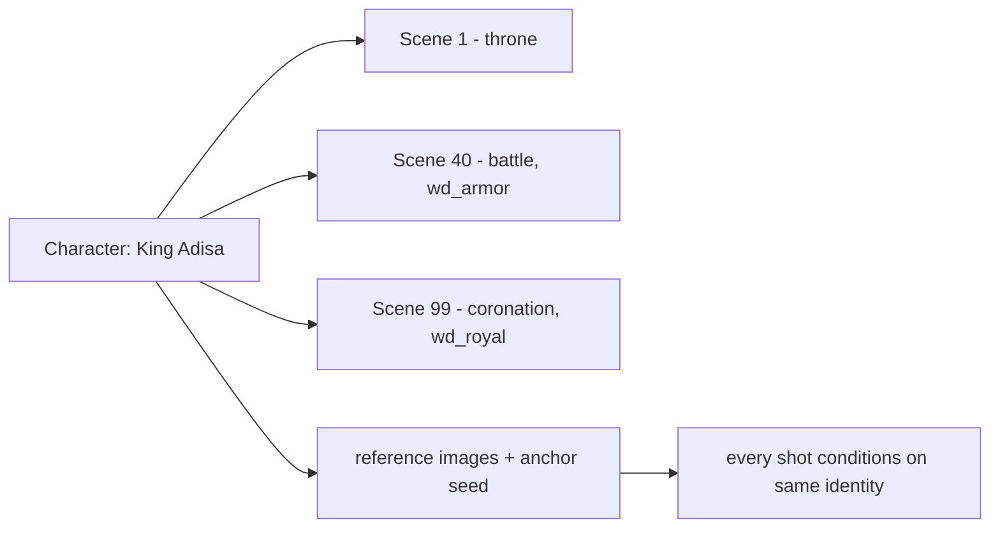

# 07 — Character Bible

Canonical, reusable definition of every character. Referenced (not inlined) by
every scene so appearance/voice never drift.

## Fields (see `Character`, `Wardrobe`, `Relationship` in schema)
- Name, Age, Gender, Ethnicity
- **Appearance** — canonical visual description (the prompt anchor)
- **Wardrobes** — named outfits with scene-validity windows
- **Voice** — `voiceProfile`: engine, voiceId, pitch, accent, sample
- Personality, Relationships, Character Arc
- **referenceUrls** — S3 keys for reference images (identity conditioning)
- **embedding** — identity embedding for QC consistency scoring

## Reusability across scenes


A scene stores `SceneCharacter(characterId, wardrobeId)`. The Prompt Builder
expands it to: canonical appearance + resolved wardrobe + reference image +
anchor seed → consistent face/body every time.

## Voice binding
`voiceProfile` links to the [Voice System](11-audio-systems.md). Example:
```json
{ "engine": "elevenlabs", "voiceId": "Xb7h...", "stability": 0.5, "accent": "West African English" }
```
Open-source fallback (XTTS/Coqui) uses a cloned sample stored in `referenceUrls`.

## Generating the Bible
The Director's Pass 4 extracts characters from the screenplay. Users can then
edit any field in the Studio UI, upload reference images
(`POST /characters/:id/reference` → presigned upload), and lock the character.

## API
```
GET   /projects/:id/characters
POST  /projects/:id/characters
PATCH /characters/:id
POST  /characters/:id/reference     -> { uploadUrl, key }
```

## Consistency techniques
- **IP-Adapter / reference image** conditioning on the GPU worker.
- **Anchor seed** per character to stabilize generation.
- **LoRA (roadmap):** train a lightweight LoRA per lead character for top-tier
  fidelity on long films (Studio/Enterprise tiers).

## Implementation checklist
- [ ] CRUD + reference upload
- [ ] Embedding extraction on reference upload
- [ ] Wardrobe management UI with validity windows
- [ ] Voice profile picker bound to TTS engines
