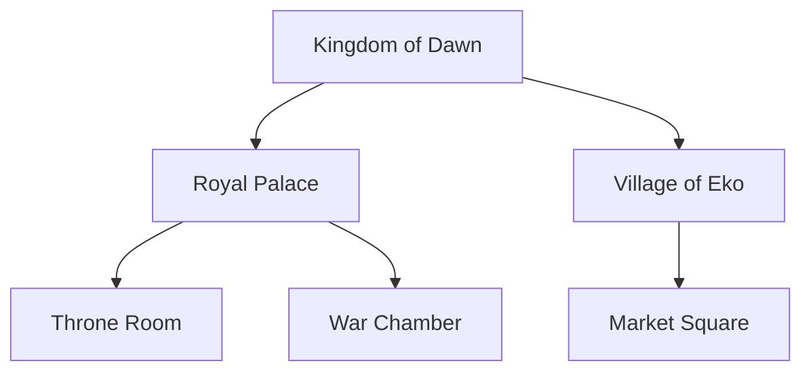

# 08 — World Bible

Canonical, reusable definitions of the world: cities, kingdoms, buildings,
rooms, landscapes, and props. Every scene references the World Bible so
locations stay visually consistent.

## Model (see `Location`, `WorldObject`)
- **Location** with `kind`: CITY | KINGDOM | BUILDING | ROOM | LANDSCAPE |
  INTERIOR | EXTERIOR
- **Hierarchy:** `parentId` — a Room belongs to a Building belongs to a City.
- `description` — canonical visual anchor.
- `referenceUrls` — establishing reference images for conditioning.
- **WorldObject** — significant props ("the crown", "ceremonial sword").

## Hierarchy example


A scene heading `INT. THRONE ROOM - NIGHT` resolves to `loc_throne_room`, whose
canonical description + reference image anchors every shot in that room across
the whole film.

## How scenes reference it
`Scene.locationId` → Location. The Prompt Builder composes:
`location.description (+ parent context) + timeOfDay + weather + continuity
world-state (e.g. "village: burned")`.

## Continuity ties
World state changes (a burned village, a flooded valley) are stored in
[ContinuityState.world](06-continuity-engine.md) and **persist forward** — the
location's canonical description is augmented by its current state at scene N.

## API
```
GET   /projects/:id/locations
POST  /projects/:id/locations
PATCH /locations/:id
POST  /locations/:id/reference     -> { uploadUrl, key }
GET   /projects/:id/objects
POST  /projects/:id/objects
```

## Implementation checklist
- [ ] CRUD + hierarchy (parent/child) UI
- [ ] Reference upload + embedding
- [ ] Establishing-shot generation per location (reused across its scenes)
- [ ] Object tracking surfaced to continuity (heldBy)
