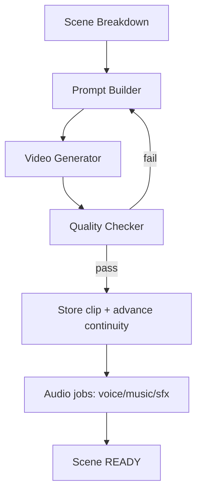

# 09 — Scene Generation Pipeline & Long-Film Batching

## Pipeline
```
Screenplay
  → Scene Breakdown        (Director: scenes + shots)
  → Prompt Construction     (Prompt Builder: bible + continuity + camera)
  → Video Generation        (GPU adapter: Wan/Hunyuan)
  → Validation              (Quality Checker)
  → Storage                 (S3) → Continuity advance
```



## Components

### Prompt Builder (`apps/api/src/scenes` / worker)

> **Status (2026-10-09):** there is no `apps/api/src/scenes`. Prompts are built
> by the DirectorOS Prompt Compiler in `packages/movie/src/prompt`
> ([docs/48](48-directoros-shots-and-prompts.md)).

Deterministically composes the final shot prompt:
```
[style/genre tokens] +
[location.description (+ parent) @ continuity.world] +
[for each character: appearance + resolved wardrobe + reference] +
[shot.description] +
[camera: shotSize, movement, angle, lens] +
[timeOfDay, weather] +
negative prompt (artifacts, extra limbs, text, watermark)
```
Plus structured conditioning: reference image keys + anchor seeds. Output is a
`ShotRequest` (see model-adapters types).

### Video Generator
Calls `ModelRegistry.get(modelId).generate(shotRequest)`. The adapter submits
to the RunPod endpoint, polls/streams, and returns `{ videoKey, gpuMs, seed }`.

### Quality Checker
Automated gates before a shot is accepted:
| Check | Method |
|-------|--------|
| Black/frozen frames | FFmpeg `blackdetect` / frame-diff |
| Identity match | embedding cosine vs character embedding |
| Wardrobe/world match | CLIP score vs expected description |
| NSFW / safety | classifier (policy-gated) |
| Duration/resolution | ffprobe |
Failures → regenerate (bump `attempts`, stronger conditioning, new seed) up to
a cap; then flag for user.

> **Status (2026-10-09):** partly built. Before a shot is `READY` the worker
> runs a **technical QC** (ffprobe picture/length/size, black and frozen runs;
> `apps/worker/src/quality/gates.ts`, `judgeClip`) and a **Visual Reviewer**
> frame check (`apps/worker/src/review/visual-gate.ts`); the master gets a
> **Final Quality Gate** (`judgeMaster`: length, sound, loudness, true peak,
> black/frozen runs). See [docs/49](49-directoros-quality-gates.md). Both gates
> default to `record` mode (`QUALITY_GATES`, `VISUAL_REVIEW`); only unusable
> media blocks until set to `enforce`. **CLIP scoring, embedding identity
> match and an NSFW output classifier are not built.** Safety is prompt
> moderation only, before planning (`apps/worker/src/director/moderation.ts`,
> OpenAI moderation endpoint).

## Long-film batching
A 30–120 min film = hundreds of shots. Strategy:

1. **Fan-out flow:** Director creates a BullMQ **flow** — parent `render-job`
   with N `scene-job` children; each scene fans out `video-job` per shot.
2. **Backpressure:** `video-queue` concurrency is bounded by available GPU
   workers; queue depth drives RunPod autoscale ([12](12-runpod-gpu.md)).
3. **Batching to GPU:** shots are dispatched in batches sized to GPU VRAM (A40
   48GB) to amortize model load; the GPU worker keeps the model warm.
4. **Priority:** `preview` renders (first 1–2 scenes) get higher priority so
   users see results fast; the rest stream in. *(Status (2026-10-09): not
   built; the `preview` and `scene` render kinds were removed — only `final`
   and `upscale` exist.)*
5. **Checkpointing:** each shot is independent and idempotent (unique
   `sceneId,index`), so failures retry without redoing the film.
6. **Progressive assembly:** scenes render to per-scene MP4s as they complete;
   the final render concatenates ready scenes (no need to wait globally to
   start preview).

### Duration → jobs (example, 30 min)
```
100 scenes × 4 shots = 400 video-jobs
each shot ~5s clip, ~A40 generation ~ (model-dependent) -> autoscale GPU pool
audio: ~100 music + ~N voice + ~M sfx jobs
1 final render-job (waits on all scenes)
```

## Implementation checklist
- [x] BullMQ flow (parent render + scene children + shot/audio grandchildren) — `film.processor.ts`
- [x] Per-shot prompt composition (basic) in the Director — `director.service.ts`
- [x] Adapter dispatch — `video.processor.ts` via `@cineforge/model-adapters`
- [x] Idempotent shot rows (unique `sceneId,index`) + retries
- [ ] Prompt Builder with full continuity composition
- [~] QC gates — ffprobe/black/frozen/length/size + visual review done (docs/49); embedding, CLIP, NSFW not built
- [ ] Preview-first prioritization
- [ ] Dead-letter for stuck shots (none today: failed jobs stay in BullMQ's failed set; the shot is marked `FAILED` and the cause is put on the project)
