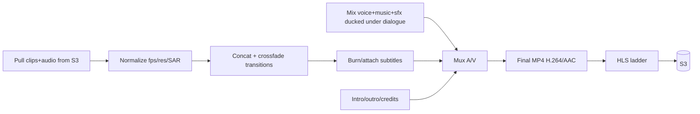

# 10 — FFmpeg Render Engine

The Render Worker assembles generated shots + audio into the final film:
stitching, transitions, crossfades, soundtrack/voice/SFX mix, subtitles,
intro/outro, and credits. Implemented in `apps/worker/src/ffmpeg`.

## Stages


## 1. Normalize every clip
Models can vary slightly in fps/SAR; normalize before concat:
```bash
ffmpeg -i shot.mp4 \
  -vf "scale=1920:1080:force_original_aspect_ratio=decrease,pad=1920:1080:(ow-iw)/2:(oh-ih)/2,setsar=1,fps=24" \
  -c:v libx264 -crf 18 -preset medium -an norm_shot.mp4
```

## 2. Crossfade transitions between shots (xfade)
```bash
ffmpeg -i a.mp4 -i b.mp4 -filter_complex \
  "[0][1]xfade=transition=fade:duration=0.5:offset=4.5,format=yuv420p" \
  out.mp4
```
For many shots, build the `xfade` chain programmatically (offsets accumulate),
or use concat for hard cuts and xfade only at scene boundaries.

## 3. Concat (hard cuts within a scene)
```bash
# concat list file
printf "file 'norm_shot1.mp4'\nfile 'norm_shot2.mp4'\n" > list.txt
ffmpeg -f concat -safe 0 -i list.txt -c copy scene.mp4
```

## 4. Audio mix with dialogue ducking (sidechaincompress)
Music ducks under voice automatically:
```bash
ffmpeg -i music.mp3 -i voice.wav -i sfx.wav -filter_complex "
  [0:a]volume=0.6[m];
  [2:a]volume=0.8[s];
  [m][1:a]sidechaincompress=threshold=0.03:ratio=8:attack=5:release=300[mducked];
  [mducked][s]amix=inputs=2:normalize=0[aout]
" -map "[aout]" -c:a aac -b:a 192k mix.m4a
```

## 5. Subtitles
```bash
# soft subs (toggleable)
ffmpeg -i film.mp4 -i subs.srt -c copy -c:s mov_text out.mp4
# or styled burn-in (.ass)
ffmpeg -i film.mp4 -vf "ass=subs.ass" -c:a copy out.mp4
```

## 6. Intro / outro / credits
Generate title/credit cards (drawtext or pre-rendered PNG sequences), then
concat with the body, crossfading into the first scene.
```bash
ffmpeg -f lavfi -i color=c=black:s=1920x1080:d=4 -vf \
 "drawtext=fontfile=/fonts/Cinzel.ttf:text='KINGDOM OF DAWN':fontcolor=white:fontsize=84:x=(w-tw)/2:y=(h-th)/2:alpha='if(lt(t,1),t,if(lt(t,3),1,4-t))'" \
 -c:v libx264 -t 4 intro.mp4
```

## 7. Final mux + HLS ladder
```bash
ffmpeg -i body.mp4 -i mix.m4a -map 0:v -map 1:a \
  -c:v libx264 -crf 19 -preset slow -c:a aac -b:a 192k -movflags +faststart final.mp4

# adaptive HLS (1080/720/480)
ffmpeg -i final.mp4 \
  -filter_complex "[0:v]split=3[v1][v2][v3];[v1]scale=1920:1080[v1o];[v2]scale=1280:720[v2o];[v3]scale=854:480[v3o]" \
  -map "[v1o]" -map 0:a -c:v:0 libx264 -b:v:0 5000k \
  -map "[v2o]" -map 0:a -c:v:1 libx264 -b:v:1 2800k \
  -map "[v3o]" -map 0:a -c:v:2 libx264 -b:v:2 1200k \
  -c:a aac -b:a 128k -f hls -hls_time 6 -hls_playlist_type vod \
  -master_pl_name master.m3u8 -var_stream_map "v:0,a:0 v:1,a:0 v:2,a:0" \
  hls/stream_%v.m3u8
```

## Node wrapper (sketch — `apps/worker/src/ffmpeg/render.ts`)
```ts
import { spawn } from "node:child_process";

export function ffmpeg(args: string[], onProgress?: (p: number) => void) {
  return new Promise<void>((resolve, reject) => {
    const p = spawn("ffmpeg", ["-hide_banner", "-progress", "pipe:1", "-nostats", ...args]);
    let durationMs = 0;
    p.stderr.on("data", (b) => {
      const m = /Duration: (\d+):(\d+):(\d+\.\d+)/.exec(b.toString());
      if (m) durationMs = (+m[1]*3600 + +m[2]*60 + +m[3]) * 1000;
    });
    p.stdout.on("data", (b) => {
      const m = /out_time_ms=(\d+)/.exec(b.toString());
      if (m && durationMs) onProgress?.(Math.min(1, +m[1] / 1000 / durationMs));
    });
    p.on("close", (c) => (c === 0 ? resolve() : reject(new Error(`ffmpeg ${c}`))));
  });
}
```

The render processor streams `render.progress` over WebSocket using
`onProgress`, uploads `final.mp4` + `hls/` to S3, and writes the `Film` row.

## Performance
- Use hardware encoders (`h264_nvenc`) on GPU render nodes for long films.
- Render scenes in parallel, concat at the end.
- `-movflags +faststart` for instant web playback.

## Implementation (code)
- Pure, unit-tested arg builders: `apps/worker/src/ffmpeg/commands.ts`
  (`normalizeArgs`, `concatArgs`, `xfadeArgs`, `audioMixArgs`, `muxArgs`,
  `hlsArgs`) + `commands.test.ts`.
- Progress-streaming runner: `apps/worker/src/ffmpeg/ffmpeg.ts`.
- Orchestrator: `apps/worker/src/ffmpeg/render-engine.ts` (download → normalize →
  concat → ducked mix → mux → poster → HLS → upload), Storage-injected.
- S3 storage port: `apps/worker/src/storage/storage.ts`.
- Wired in `render.processor.ts`, emitting `render.progress` + `film.ready`.

## Implementation checklist
- [x] Clip normalization step
- [x] Ducked audio mixdown (sidechaincompress + R128 loudnorm)
- [x] Concat assembly + mux + faststart
- [x] HLS ladder + S3 upload + Film row write
- [ ] Programmatic xfade chain across scene boundaries (builder present; wiring TODO)
- [ ] Subtitle styling (.ass) generator from `DialogueLine`
- [ ] Intro/outro/credits templates
- [ ] Per-scene audio timeline placement (current mix is a single bed)
