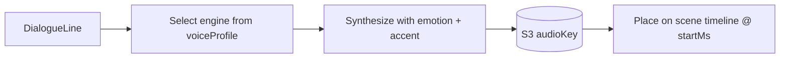
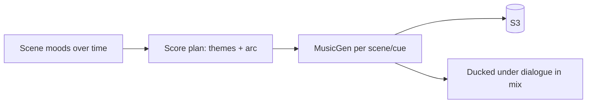
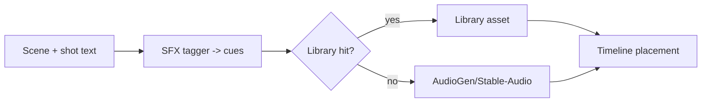

# 11 — Audio Systems: Voice, Music, SFX

All audio is generated per scene, placed on a timeline, and mixed by the Render
Engine ([10](10-ffmpeg-render.md)). Audio jobs run on the `audio-queue`.

## Voice System

### Engines (pluggable, like model-adapters)
| Engine | Use | Notes |
|--------|-----|-------|
| ElevenLabs | premium narration/dialogue | best quality, paid |
| XTTS-v2 / Coqui | open-source default | self-hosted, voice cloning |
| Piper | low-latency narration | lightweight |

### Voice cloning
A character's `voiceProfile` points to a cloned voice (ElevenLabs voiceId or an
XTTS reference sample in S3). Every line that character speaks uses the same
voice → consistent across the whole film.

### Types of speech
- **Narration** — project-level narrator voice.
- **Dialogue** — `DialogueLine.characterId` → that character's voice + emotion.
- **Character voices** — bound via Character Bible.

### Flow


### Adapter interface
```ts
interface VoiceAdapter {
  id: string;
  synthesize(req: {
    text: string; voiceId: string; emotion?: string;
    language?: string; speed?: number;
  }): Promise<{ audioKey: string; durationMs: number }>;
  clone?(sampleKey: string, name: string): Promise<{ voiceId: string }>;
}
```

## Music System

Scene-aware, mood-tracked soundtrack that adapts to story progression.

### Engines
- **MusicGen** (Meta, open-source, self-hosted on GPU) — default.
- **Suno/Udio API** — premium (roadmap, if licensing fits).

### Mood tracking
The Director annotates each scene with a **mood** (tension, triumph, grief).
The music system maintains a **score plan** across the film so themes recur and
intensity follows the dramatic arc (e.g. a "kingdom theme" returns at the
coronation). Cross-scene continuity of key/tempo avoids jarring jumps.



### Adapter interface
```ts
interface MusicAdapter {
  id: string;
  generate(req: {
    mood: string; durationSec: number; key?: string; tempo?: number;
    themeRef?: string;     // recurring motif id
  }): Promise<{ audioKey: string; durationMs: number }>;
}
```

## Sound Effects System

Automatic, scene-content-aware SFX: footsteps, crowds, rain, battle, doors,
animals, etc.

### How cues are derived
1. The Director/scene summary + shot descriptions are scanned for SFX triggers
   (NLP keyword + LLM tagging) → `SfxCue[]` with type + timing.
2. Each cue resolves to either:
   - a **library asset** (curated CC0/licensed SFX pack in S3), or
   - **generated SFX** via AudioGen/Stable-Audio for novel sounds.
3. Cues are placed on the scene timeline (`AudioTrack kind=SFX/AMBIENCE`).



### Cue model
```ts
type SfxCue = { type: string; startMs: number; durationMs: number; gainDb?: number; loop?: boolean };
```

## Mixing
The Render Engine layers: **ambience (bed) → SFX → music (ducked) → voice
(top)**, normalizes loudness (EBU R128, `loudnorm`), then muxes with video.

## Implementation checklist
- [ ] Voice adapter registry (ElevenLabs + XTTS) + cloning
- [ ] MusicGen worker + score-plan/mood tracker
- [ ] SFX tagger + library index + AudioGen fallback
- [ ] Timeline placement + R128 loudness normalization
