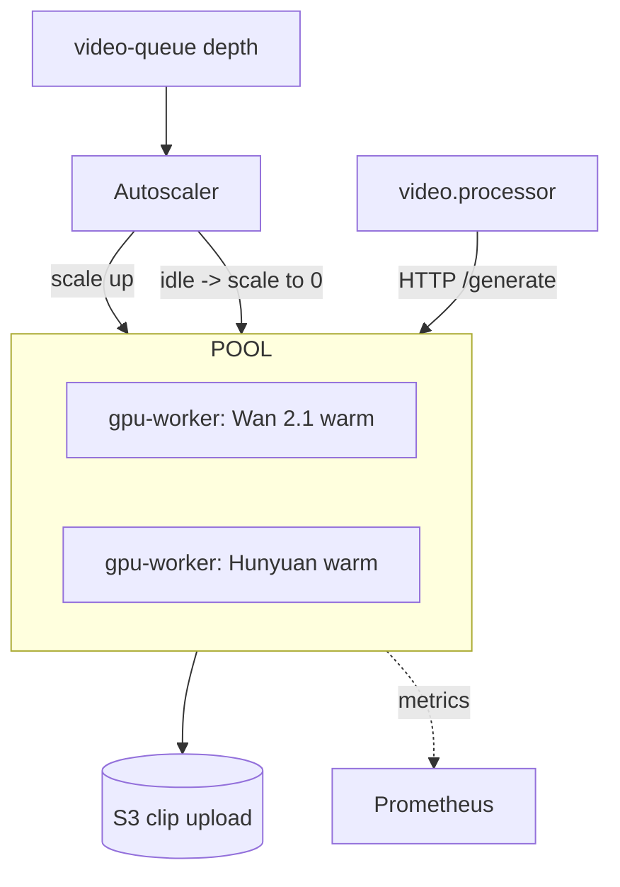
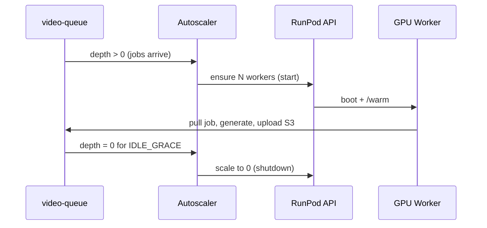

# 12 — RunPod GPU Integration

GPU workers run the open-source video models. They are **decoupled from the app
via the queue**, autoscaled by queue depth, and shut down when idle.

Target hardware: **RunPod A40 48GB** (fits Wan 2.1 and Hunyuan with headroom).

## Topology


Two deployment modes (use both):
- **RunPod Serverless** — best for bursty load; per-second billing, scale to
  zero, cold starts mitigated by FlashBoot + warm pool.
- **On-demand Pods** — for sustained large-film jobs; cheaper per hour when
  busy; managed by our autoscaler via the RunPod API.

## GPU worker service (`apps/gpu-worker`, Python/FastAPI)
```
POST /generate     { prompt, negativePrompt, seed, durationSec, refImageUrls, camera } -> { videoKey, gpuMs }
GET  /capabilities -> { model, maxDuration, resolutions, supportsRefImage }
GET  /health       -> { status, modelLoaded, vramFreeMb }
POST /warm         -> preloads model weights
```
The worker: loads the model once (kept warm), runs inference, uploads the clip
straight to S3, and returns the S3 key + measured `gpuMs`.

## Model loading strategy
- **Bake weights into the image** (or a RunPod network volume) to avoid
  per-cold-start downloads.
- **Load once, keep warm** in process memory; `/warm` preloads on boot.
- One model per worker type (Wan pool, Hunyuan pool) so VRAM is predictable.
- Batch shots per request where the model supports it to amortize overhead.

## Autoscaling strategy (planned as `apps/worker/src/gpu/autoscaler.ts`)

> **Status (2026-10-09):** there is no `apps/worker/src/gpu/autoscaler.ts`. The
> GPU lifecycle is `packages/gpu` (`lifecycle-manager.ts`, `cluster.ts`,
> `runpod-control.ts`), started from `apps/worker/src/main.ts`
> (`createGpuManagers`), which runs each pool's reconcile loop and reconciles
> immediately when a GPU queue drains. See [docs/23](23-gpu-lifecycle-manager.md).
```
target_workers = clamp(ceil(pending_video_jobs / jobs_per_worker),
                       min=0, max=tier_cap)
```
- Scale **up** when `video-queue` waiting > threshold.
- Scale **down**/to-zero when queue empty for `IDLE_GRACE` (e.g. 120s) — but
  keep ≥1 warm during business hours if SLA requires.
- Separate caps per model and per environment.
- Drive via RunPod REST API (start/stop serverless workers or pods).

## Idle shutdown strategy
- Each worker tracks `last_job_finished_at`. If idle > `IDLE_GRACE` and queue
  empty, it self-terminates (serverless scales to 0 automatically).
- The autoscaler is the safety net: it reconciles desired vs actual every N
  seconds and stops orphaned pods.

> **The authoritative mechanism for start-on-demand + auto-shutdown is the
> [Auto GPU Lifecycle Manager](23-gpu-lifecycle-manager.md) (Phase 1).** It
> reference-counts active jobs across all users/nodes and shuts the GPU down
> only after the **last** generation completes + a 15-min grace period —
> `ACTIVE==0 && QUEUED==0 && IDLE>=15m`. The per-worker self-termination above
> is a redundant secondary guard.

## "Start on demand" lifecycle


## Cost optimization strategy
| Lever | Action |
|-------|--------|
| Scale to zero | No idle GPU spend; pay per second of generation |
| Warm pool sizing | Keep 0–1 warm based on traffic forecast |
| Spot/community GPUs | Use cheaper RunPod community cloud for non-SLA jobs |
| Batch + warm model | Amortize model load across many shots |
| Right model per tier | Wan 2.1 (cheap) default; Hunyuan only for premium |
| Resolution/length caps | Per-tier caps on clip res/length |
| Preview-first | Generate cheap preview before committing full film |
| Caching | Reuse establishing shots per location; reuse seeds |

## Cost model (illustrative — calibrate before launch)
```
A40 on-demand ≈ $X/hr  => $X/3600 per GPU-second
shot_cost ≈ (gpuMs/1000) * per_GPU_second
film_cost ≈ Σ shot_cost + audio + render
```
Bill users in `creditsMs` (GPU-ms) so price changes don't break quotas.

## Implementation checklist
- [ ] FastAPI worker (Wan + Hunyuan), S3 upload, gpuMs measurement
- [ ] Image with baked weights / network volume
- [ ] RunPod API client (start/stop serverless + pods)
- [ ] Autoscaler reconcile loop driven by queue depth
- [ ] Idle self-termination + orphan reconciliation
- [ ] Per-tier model/resolution/length caps
