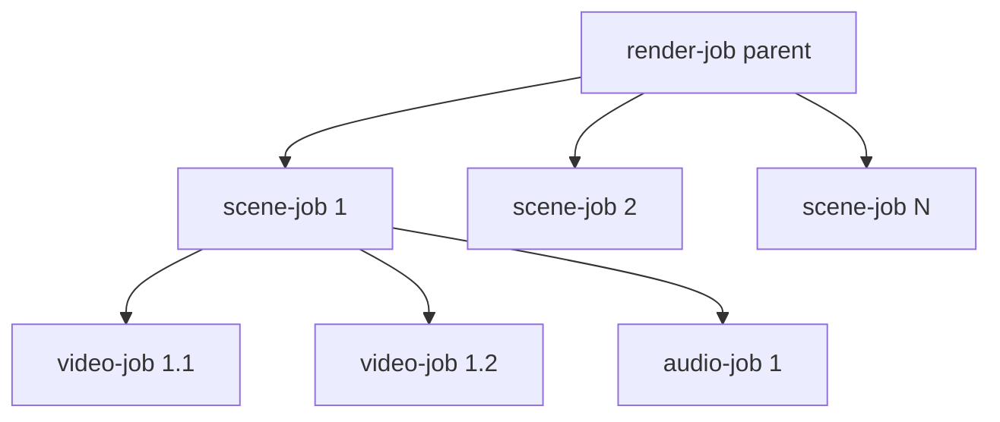

# 13 — Queue Architecture (BullMQ)

Redis-backed BullMQ. Queue names and job payloads are defined once in
`packages/shared/src/queue` and imported by both producers (API) and consumers
(worker) so contracts never drift.

## Queues
| Queue | Producer | Consumer | Job |
|-------|----------|----------|-----|
| `film-queue` | worker project poller (new `projects` rows) / API `POST /v1/generate-film` | Director worker | plan film, fan out scenes |
| `scene-queue` | film flow (`orchestration/film-flow.ts`) | Scene worker | scene finalize after its shots + audio |
| `video-queue` | film flow (child of a scene) | Video worker → GPU | generate one shot |
| `audio-queue` | film flow (child of a scene) | Audio worker | voice / music (no sfx generator) |
| `render-queue` | film flow (root job) / project poller / passes | Render worker | FFmpeg assemble (`final`) or 4K `upscale` |
| `lora-queue` | worker (`orchestration/lora-queue.ts`) | LoRA worker | train a character LoRA |
| `localize-queue` | worker (`orchestration/localize-queue.ts`) | Localize worker | subtitles + dubs |
| `voice-lab-queue` | project poller | Voice Lab worker | clone / speak / avatar |
| `voice-engine-queue` | project poller | Voice Engine worker | one `voice_jobs` row (docs/51) |
| `social-queue` | project poller | Social worker (`social.processor.ts`) | Social Launchpad `kit` / `launch` (docs/31) |

There is no `publish-queue` (removed 2026-10-09; it had no producer).

## Flow (parent/children) for a full film
BullMQ **Flows** model dependencies: the final render waits for all scenes,
each scene waits for its shots.



## Job contracts (`packages/shared/src/queue/contracts.ts`)
```ts
export const QUEUES = {
  film: "film-queue",
  scene: "scene-queue",
  video: "video-queue",
  audio: "audio-queue",
  render: "render-queue",
  lora: "lora-queue",
  localize: "localize-queue",
  voiceLab: "voice-lab-queue",
  voiceEngine: "voice-engine-queue",
  social: "social-queue",
} as const;

export interface FilmJob   { projectId: string; }
export interface SceneJob  { projectId: string; sceneId: string; index: number; }
export interface VideoJob  { projectId: string; sceneId: string; shotId: string; modelId: string; }
export interface AudioJob  { projectId: string; sceneId: string; kind: "voice"|"music"|"sfx"; refId?: string; }
export interface RenderJob { projectId: string; kind: "final"|"upscale"; }
```

## Worker config
```ts
// apps/worker/src/processors/video.processor.ts (sketch)
new Worker<VideoJob>(QUEUES.video, async (job) => {
  const adapter = registry.get(job.data.modelId);
  const shot = await db.shot.findUniqueOrThrow({ where: { id: job.data.shotId }});
  const res = await adapter.generate(buildShotRequest(shot));
  await db.shot.update({ where: { id: shot.id }, data: { status: "READY", videoKey: res.videoKey, gpuMs: res.gpuMs }});
  return res;
}, {
  connection,
  concurrency: Number(process.env.VIDEO_CONCURRENCY ?? 4),  // bounded by GPU pool
  limiter: { max: 100, duration: 1000 },
});
```

## Reliability
- **Retries** with exponential backoff (`attempts: 3, backoff: { type:"exponential", delay: 5000 }`).
- **Idempotency:** shots keyed by `(sceneId,index)`; re-processing upserts.
- **No dead-letter queues.** A job that fails after its retries stays in
  BullMQ's failed set; the processor marks the project/shot `FAILED` and puts
  the reason on the project (shown in the UI).
- **Stalled jobs:** BullMQ stalled-detection re-queues crashed workers' jobs.
- **Priorities:** by plan tier (`tierPriority`, `orchestration/film-flow.ts`);
  there is no preview lane.
- **Rate limiting:** per-queue limiter protects GPU/3rd-party APIs.

## Observability

> **Status (2026-10-09):** bull-board and a BullMQ exporter are not built. The
> worker's health server counts completed/failed jobs per queue
> (`apps/worker/src/health.ts`, `countJobs`).

- `bull-board` admin UI mounted behind admin auth.
- BullMQ Prometheus exporter → queue depth, throughput, failure rate
  ([18](18-devops.md)).
- Queue depth feeds the GPU lifecycle manager (`packages/gpu`, [23](23-gpu-lifecycle-manager.md)).

## Scaling
- Each queue scales independently by worker replica count + concurrency.
- Redis in cluster mode; separate Redis (or logical DBs) for queue vs cache.

## Implementation checklist
- [x] Shared queue contracts (`packages/shared/src/queue`)
- [x] Flow producer for full-film fan-out (`apps/worker/src/processors/film.processor.ts`)
- [x] Processors for all 5 queues (`film`/`scene`/`video`/`audio`/`render`) with retries
- [ ] bull-board + Prometheus exporter (no DLQs; see Reliability)
- [x] Tier priority (no preview lane; `preview`/`scene` render kinds removed)
- [ ] Real Director LLM, GPU inference, audio adapters, FFmpeg assembly (stubs in place)
