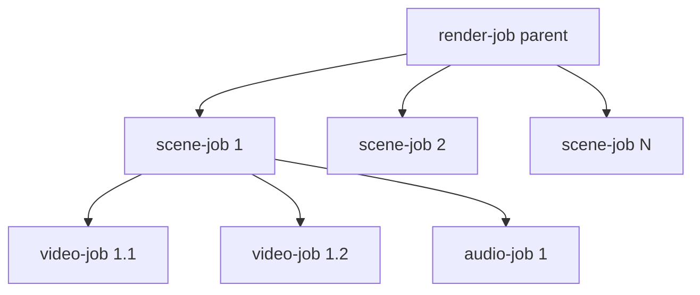

# 13 — Queue Architecture (BullMQ)

Redis-backed BullMQ. Queue names and job payloads are defined once in
`packages/shared/src/queue` and imported by both producers (API) and consumers
(worker) so contracts never drift.

## Queues
| Queue | Producer | Consumer | Job |
|-------|----------|----------|-----|
| `film-queue` | API `/generate-film` | Director worker | plan film, fan out scenes |
| `scene-queue` | Director / API | Scene worker | build prompts, fan out shots |
| `video-queue` | Scene worker | Video worker → GPU | generate one shot |
| `audio-queue` | Scene worker | Audio worker | voice/music/sfx |
| `render-queue` | Director / API `/render` | Render worker | FFmpeg assemble |

## Flow (parent/children) for a full film
BullMQ **Flows** model dependencies: the final render waits for all scenes,
each scene waits for its shots.



## Job contracts (`packages/shared/src/queue/contracts.ts`)
```ts
export const QUEUES = {
  film: "film-queue",
  scene: "scene-queue",
  video: "video-queue",
  audio: "audio-queue",
  render: "render-queue",
} as const;

export interface FilmJob   { projectId: string; }
export interface SceneJob  { projectId: string; sceneId: string; index: number; }
export interface VideoJob  { projectId: string; sceneId: string; shotId: string; modelId: string; }
export interface AudioJob  { projectId: string; sceneId: string; kind: "voice"|"music"|"sfx"; refId?: string; }
export interface RenderJob { projectId: string; kind: "preview"|"final"|"scene"; sceneId?: string; }
```

## Worker config
```ts
// apps/worker/src/processors/video.processor.ts (sketch)
new Worker<VideoJob>(QUEUES.video, async (job) => {
  const adapter = registry.get(job.data.modelId);
  const shot = await db.shot.findUniqueOrThrow({ where: { id: job.data.shotId }});
  const res = await adapter.generate(buildShotRequest(shot));
  await db.shot.update({ where: { id: shot.id }, data: { status: "READY", videoKey: res.videoKey, gpuMs: res.gpuMs }});
  return res;
}, {
  connection,
  concurrency: Number(process.env.VIDEO_CONCURRENCY ?? 4),  // bounded by GPU pool
  limiter: { max: 100, duration: 1000 },
});
```

## Reliability
- **Retries** with exponential backoff (`attempts: 3, backoff: { type:"exponential", delay: 5000 }`).
- **Idempotency:** shots keyed by `(sceneId,index)`; re-processing upserts.
- **Dead-letter:** failed-after-retries jobs go to a `*-dlq` for inspection.
- **Stalled jobs:** BullMQ stalled-detection re-queues crashed workers' jobs.
- **Priorities:** preview/first-scene jobs get higher priority for fast TTFB.
- **Rate limiting:** per-queue limiter protects GPU/3rd-party APIs.

## Observability
- `bull-board` admin UI mounted behind admin auth.
- BullMQ Prometheus exporter → queue depth, throughput, failure rate
  ([18](18-devops.md)).
- Queue depth feeds the GPU autoscaler ([12](12-runpod-gpu.md)).

## Scaling
- Each queue scales independently by worker replica count + concurrency.
- Redis in cluster mode; separate Redis (or logical DBs) for queue vs cache.

## Implementation checklist
- [ ] Shared queue contracts + connection factory
- [ ] Flow producer for full-film fan-out
- [ ] Processors for all 5 queues with retries/DLQ
- [ ] bull-board + Prometheus exporter
- [ ] Priority lanes for preview
