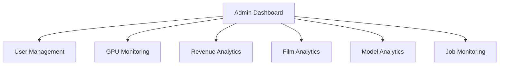

# 16 — Admin Dashboard

Lives under `apps/web/app/admin` (role=ADMIN, guarded). Backed by
`apps/api/src/admin`. Real-time panels use the same WebSocket gateway.

## Panels


### User management
- List/search users; view tier, `creditsMs`, usage, projects.
- Actions: change tier, grant credits, suspend/ban, reset password, revoke API
  keys, impersonate (audited).

### GPU monitoring
- Live pool size per model, utilization, VRAM, queue depth, autoscale events,
  cost/hour, idle time. Data from Prometheus + RunPod API.

### Revenue analytics
- MRR, ARPU, conversions by tier, churn, credit-pack sales, **gross margin =
  revenue − (GPU + audio API + storage/CDN)**. From Stripe + `UsageRecord`.

### Film analytics
- Films/day, avg length, completion rate, failure reasons, avg render time,
  most-used genres, views/watch-time.

### Model analytics
- Per-model: jobs, success rate, avg gpuMs/shot, QC pass rate, cost/min,
  user satisfaction (regeneration rate as a proxy).

### Job monitoring
- `bull-board` embed: per-queue waiting/active/failed, DLQ inspection, retry,
  drill into a film's flow tree. Live via WebSocket.

## Admin API
```
GET /admin/users?cursor=&q=        GET /admin/users/:id
POST /admin/users/:id/credits      POST /admin/users/:id/tier      POST /admin/users/:id/suspend
GET /admin/gpu                     GET /admin/gpu/events
GET /admin/revenue?range=          GET /admin/films?range=         GET /admin/models
GET /admin/jobs                    POST /admin/jobs/:id/retry
```

## Implementation checklist
- [ ] Admin guard + audit log for sensitive actions
- [ ] Metrics aggregation service (Prometheus query + Stripe + DB)
- [ ] bull-board embed behind admin auth
- [ ] Charts (revenue, GPU, films, models)
