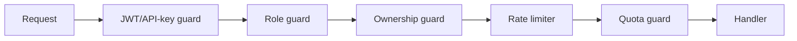

# 17 — Security Architecture

## Authentication & authorization
- **JWT** access tokens (short-lived, 15m) + rotating **refresh tokens**
  (httpOnly cookie or secure store). RS256 with rotating keys (JWKS).
- **RBAC** via Nest guards: `USER` vs `ADMIN`; resource ownership checks
  (project/scene/film belong to caller) on every route.
- **API keys** for programmatic access (Studio+): hashed at rest, scoped,
  revocable, last-used tracked.

## Rate limiting & abuse detection
- Per-IP and per-user limits (Redis token bucket); stricter on auth & generate
  endpoints. `429 + Retry-After`.
- **Abuse signals:** rapid project churn, repeated policy-violating prompts,
  credit-farming patterns, signup velocity → throttle/flag/ban.
- Captcha/email-verify on signup for Free tier; device/IP reputation.

## Prompt filtering / content safety
- **Input:** classify user prompts before planning (block disallowed content —
  CSAM, real-person deepfakes, extreme violence per policy). Maintain blocklist
  + LLM safety classifier.
- **Output:** QC stage runs an NSFW/safety classifier on generated frames; fail
  → block + flag. Voice cloning requires consent attestation.
- Audit trail of moderation decisions for appeals.

## Storage security
- Private buckets; access only via short-lived presigned URLs / CDN signed
  tokens. Ownership validated before signing.
- SSE (KMS) at rest; TLS in transit. Per-project prefix isolation.

## API protection
- HTTPS only, HSTS. CORS allowlist. Helmet headers.
- Input validation everywhere (zod/class-validator); reject unknown fields.
- Webhooks (Stripe, RunPod) verify signatures.
- SSRF guard on any URL the worker fetches (reference images): allowlist
  schemes/hosts, block internal ranges.
- Secrets via env/secret manager (never in repo); least-privilege IAM for S3.

## Data protection & compliance
- PII minimization; encrypt sensitive fields. GDPR delete = project-prefix S3
  purge + DB cascade. Audit logs for admin actions.

## Infrastructure
- Network policies: GPU workers reachable only from worker tier; DB/Redis not
  public. WAF in front of the API/CDN. Dependency scanning + image scanning in
  CI ([18](18-devops.md)).

## Implementation checklist
- [ ] JWT (RS256 + JWKS) + refresh rotation
- [ ] Guards: auth, role, ownership, rate-limit, quota
- [ ] Prompt safety classifier (in/out) + moderation log
- [ ] Presigned-URL ownership checks + SSRF guard
- [ ] Webhook signature verification
- [ ] Secret management + least-privilege IAM
