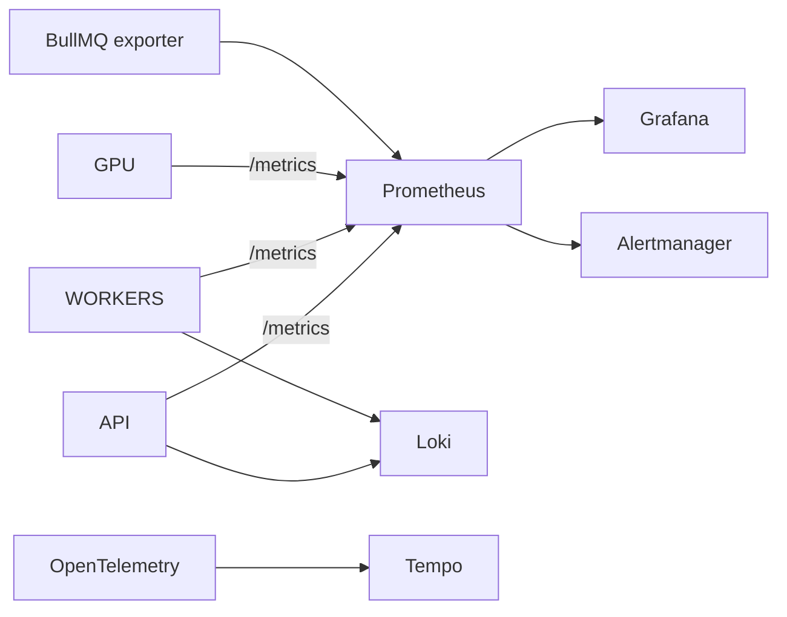

# 18 — DevOps: Docker, CI/CD, Monitoring

## Local development
```bash
pnpm install
cp .env.example .env
docker compose up -d                 # postgres + redis + minio
pnpm --filter @cineforge/db prisma migrate dev
pnpm dev                             # turbo: web + api + worker
```
`docker-compose.yml` provides Postgres, Redis, MinIO (S3). GPU work is mocked
locally via a stub adapter so the pipeline runs without a GPU.

## Containers
- `infra/docker/web.Dockerfile` — Next.js standalone build.
- `infra/docker/api.Dockerfile` — NestJS.
- `infra/docker/worker.Dockerfile` — worker + **FFmpeg** baked in.
- `apps/gpu-worker/Dockerfile` — CUDA base + model weights + FastAPI (RunPod).

All Node images are multi-stage (pnpm fetch → build → slim runtime).

## CI/CD (GitHub Actions)
```
.github/workflows/
  ci.yml      # on PR: install, lint, typecheck, test, prisma validate, build
  image.yml   # on main: build+push web/api/worker images to registry (GHCR)
  gpu.yml     # on change to apps/gpu-worker: build+push GPU image to RunPod registry
  deploy.yml  # on tag: helm upgrade staging -> manual approve -> prod
```
- PR gates: ESLint, `tsc --noEmit`, unit/integration tests, `prisma validate`,
  build all apps. Trivy image scan + `pnpm audit`.
- Migrations run as a pre-deploy Job (`prisma migrate deploy`).

## Kubernetes (prod) — `infra/k8s` (Helm)
- Deployments: `web`, `api`, `worker-*` (one per queue), each with **HPA**
  (CPU/RPS, or KEDA on queue depth for workers).
- `api` exposed via Ingress + WAF + CDN. WebSocket uses Redis adapter.
- PgBouncer sidecar/service for Postgres pooling.
- Secrets via Sealed Secrets / external-secrets.
- GPU workers are **not** in k8s — they live on RunPod, reached over the queue +
  HTTP; the autoscaler runs as a small Deployment.

## Monitoring & logging — `infra/monitoring`

- **Prometheus** scrapes app `/metrics` (prom-client), node, cAdvisor, BullMQ
  exporter, RunPod metrics.
- **Grafana** dashboards: API latency/RPS/errors, queue depth/throughput, GPU
  utilization/cost, render times, revenue/margin (from [16](16-admin-dashboard.md)).
- **Alertmanager** rules: queue backlog, GPU stuck, error-rate spike, DLQ
  growth, low credits-grant failures, Stripe webhook failures.
- **Loki** structured logs (pino, request-id correlation). **OpenTelemetry**
  tracing across API→queue→worker→GPU.

## Key metrics (SLIs)
| Metric | Target |
|--------|--------|
| API p95 latency | < 300ms (non-generate) |
| Time-to-first-preview | < 2 min |
| Shot success rate | > 95% after retries |
| Queue backlog age | < 5 min p95 |
| GPU idle waste | < 10% |

## Implementation checklist
- [ ] docker-compose + Dockerfiles (FFmpeg in worker image)
- [ ] GitHub Actions: ci/image/gpu/deploy
- [ ] Helm charts + HPA/KEDA
- [ ] Prometheus/Grafana/Loki/Alertmanager + OTel
- [ ] Migration job in deploy pipeline
