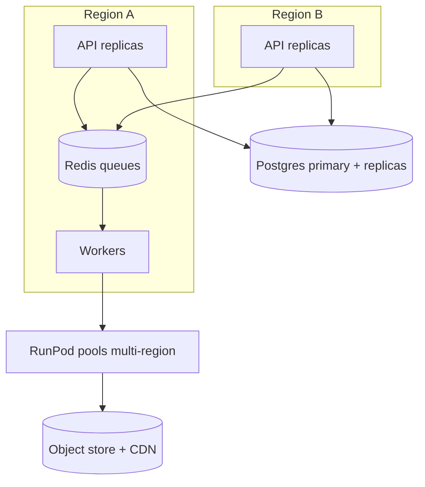

# 19 — Scaling (10 → 1,000,000 users) & Cost Optimization

## Principle
Every tier is **stateless and queue-decoupled**, so capacity is added by
replicas. The only stateful systems (Postgres, Redis, S3) scale via well-known
patterns. GPUs scale to zero, so cost tracks usage, not user count.

## Scaling by stage

### 10–1k users (single region)
- 1 small k8s cluster (or even docker-compose on one box for <100).
- API 2 replicas, one worker replica per queue, RunPod serverless (scale-to-0).
- Single Postgres + Redis. MinIO or R2.

### 1k–100k users
- API HPA (CPU/RPS), workers scaled per-queue (KEDA on queue depth).
- Postgres: primary + read replica, PgBouncer pooling.
- Redis: separate cache vs queue instances.
- RunPod: warm pool + autoscale; multiple GPU model pools.
- CDN in front of all film/HLS reads.

### 100k–1M users (multi-region)
- Stateless tiers replicated per region; GeoDNS/anycast.
- Postgres: partition `Shot`/`UsageRecord`/`AudioTrack`; read replicas per
  region; consider Citus/Vitess-style sharding by `projectId` if needed.
- Redis Cluster. Client fan-out is Supabase Realtime (no WebSocket tier of our own).
- Object storage with cross-region replication; CDN multi-PoP.
- GPU capacity across multiple RunPod regions/providers; queue-routed.
- Async everything: generation is already async; keep API hot-path < 300ms.



## Bottlenecks & mitigations
| Bottleneck | Mitigation |
|-----------|------------|
| GPU throughput | autoscale, batch, multi-provider, model right-sizing |
| Postgres writes (shots) | partitioning, batch inserts, move hot counters to Redis |
| Redis memory | separate queue/cache, eviction policy, cluster |
| Render CPU | GPU-accelerated FFmpeg (nvenc), parallel scene render |
| Egress cost | R2/B2 zero-egress + CDN caching |
| Live-update fan-out | Supabase Realtime (Postgres Changes, RLS-scoped) |

## Cost optimization (system-wide)
1. **Scale GPUs to zero** — biggest lever; pay per generation-second.
2. **Right model per tier** — Wan 2.1 default, Hunyuan only when paid for.
3. **Preview-first** — cheap low-res preview before committing full render.
4. **Caching & reuse** — establishing shots per location; deterministic seeds;
   reuse audio beds; prompt-cache LLM context in the Director.
5. **Spot/community GPUs** for non-SLA jobs; on-demand for SLA.
6. **Per-tier caps** on resolution/length/concurrency.
7. **Cold-tier raw shots**, keep only finished films hot.
8. **Zero-egress storage + CDN** for streaming.
9. **Batch GPU dispatch** to amortize model load.
10. **Autoscale workers on queue depth** (KEDA) — no idle worker spend.

## Unit economics target
```
revenue_per_film  − ( gpu_cost + audio_api + storage + cdn + render )  = margin
```
Track per-film margin in the admin dashboard; alert if margin < threshold so
pricing/caps can be tuned.

## Capacity math (sanity)
- Hot path (API/WS) is cheap and horizontal → user count is not the constraint.
- The constraint is **concurrent generation**, bounded by GPU budget and
  per-tier concurrency — exactly what autoscale + quotas govern.
