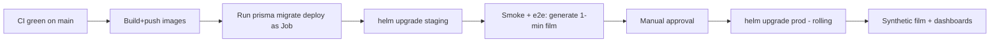

# 20 — Production Deployment Plan

## Environments
| Env | Purpose | Infra |
|-----|---------|-------|
| local | dev | docker-compose + pnpm dev, GPU mocked |
| staging | pre-prod, full pipeline | k8s + RunPod (small pool) |
| production | live | k8s (multi-AZ) + RunPod (autoscaled) |

## Provisioning checklist
1. **Postgres** (managed, e.g. RDS/Cloud SQL/Neon) + PgBouncer.
2. **Redis** (managed) — separate instances/DBs for queue vs cache.
3. **Object storage** — S3/R2/B2 bucket + lifecycle rules + CDN.
4. **Kubernetes** cluster — node pools for api/worker; ingress + WAF.
5. **RunPod** — serverless endpoints (Wan, Hunyuan) + API token; bake model
   images; network volume for weights.
6. **Secrets** — external-secrets/Sealed Secrets; Stripe, ElevenLabs, RunPod,
   Anthropic, S3 creds.
7. **DNS/CDN** — app, api, cdn subdomains; TLS certs.
8. **Observability** — Prometheus/Grafana/Loki/Alertmanager; OTel collector.

## Rollout sequence

## Deploy strategy
- **Rolling updates** for stateless tiers; `maxUnavailable: 0`.
- **DB migrations** are backward-compatible (expand/contract): deploy code that
  works with old+new schema, migrate, then remove old paths.
- **GPU images** rolled independently (versioned RunPod endpoints); the adapter
  pins an endpoint version so app and GPU deploy decouple.
- **Feature flags** for risky features (new models, LoRA).

## Smoke / acceptance test
A scripted e2e that:
1. registers a user, 2. creates a project, 3. `POST /generate-film` (1-min),
4. waits for `film.ready` over WS, 5. fetches `streamUrl` and validates the
HLS manifest + MP4 with ffprobe. Run in CI against staging and post-prod.

## Backups & DR
- Postgres PITR + daily snapshots; tested restores.
- Object storage versioning + cross-region replication for finished films.
- Redis: queues are reconstructable from DB state (jobs are idempotent); cache
  is disposable. Document RPO/RTO (target RPO ≤ 5 min, RTO ≤ 1 h).

## Runbooks (in repo `docs/runbooks/` — to add)
- GPU pool stuck / RunPod outage → reroute to backup provider.
- Queue backlog → scale workers/GPU, check DLQ.
- Failed renders spike → inspect FFmpeg logs, roll back render image.
- Stripe webhook failures → replay from Stripe dashboard.

## Go-live gate
- [ ] e2e smoke green on staging + prod
- [ ] Dashboards + alerts wired
- [ ] Quotas/billing verified with Stripe test→live
- [ ] Safety classifiers enabled (in/out)
- [ ] Backups + restore tested
- [ ] Load test: N concurrent 5-min films within GPU budget
