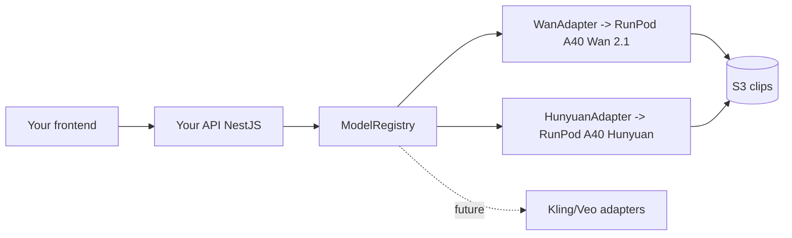

# 22 — Video Models & the "Own API" Strategy

This is the cost/strategy core of Cineforge: **run open-source video models on
your own RunPod GPUs and expose your own API on top**, instead of paying
per-generation fees to Runway/Kling/Pika/Luma.

## Models

| Role | Model | Where it runs | Tiers | Why |
|------|-------|---------------|-------|-----|
| **Primary** | **Wan 2.1** | RunPod **A40 48GB** GPU worker | all tiers | Strong quality at the lowest GPU-seconds; the default for every film |
| **Premium** | **Hunyuan Video** | RunPod **A40 48GB** GPU worker | Studio/Enterprise | Higher fidelity for paid tiers; ~2× GPU cost |
| Future | Kling, Veo, CogVideoX, … | external API or self-hosted | configurable | Plug in via an adapter, no app changes |

## Why self-host (the cost thesis)
- **No per-generation API fees.** You pay only for **GPU-seconds** on RunPod,
  which scale to zero when idle ([12](12-runpod-gpu.md)).
- **You own the pricing.** Bill users in `creditsMs` (GPU-ms); margin =
  subscription − GPU/audio/storage cost ([15](15-monetization.md)).
- **Capability parity with Runway/Kling/Pika/Luma** for the core
  text/image→video task, while keeping the unit economics under your control.
- **No vendor lock-in or rate limits** dictated by a third party.



## "Build your own API on top"
The whole platform **is** your API. Models are never called directly by the
frontend — they sit behind:

1. `packages/model-adapters` — the `VideoModelAdapter` interface + `WanAdapter`
   / `HunyuanAdapter` (both proxy to a RunPod A40 worker via `RunpodClient`).
2. `ModelRegistry` — resolve a model by `id`; `GET /models` lists capabilities.
3. Your REST/WS API ([04](04-api-spec.md)) — `/generate-film`,
   `/generate-scene`, `/render`, streaming, billing — none of which expose the
   underlying model vendor.

Adding a model later = one adapter + `registry.register(...)`. **Frontend and
API contracts don't change** (`modelId` is just a string the UI lists).

## RunPod A40 48GB fit
- 48GB VRAM comfortably hosts Wan 2.1 and Hunyuan with headroom for reference
  conditioning and batching.
- Model weights baked into the image / network volume; loaded once and kept
  warm; scale-to-zero on idle ([12](12-runpod-gpu.md)).

## External providers (drop-in)

Wan and Hunyuan are **self-hosted** (you operate the GPU; no API key). For a
**hosted** provider you "drop a key into," there's a generic
`ExternalApiAdapter` (`class: "external"`) that implements the same
`VideoModelAdapter` contract. Set two env vars and the model auto-registers —
it appears at `GET /models` and is dispatchable like any other model, with no
API or frontend changes:

```
EXTERNAL_VIDEO_API_URL=https://provider.example/v1
EXTERNAL_VIDEO_API_KEY=sk-...
EXTERNAL_VIDEO_MODEL_ID=external-video      # used in shots/projects.model_id
EXTERNAL_VIDEO_MAX_SEC=10
ASSET_PUBLIC_BASE_URL=https://cdn.example   # so the provider can fetch seed frames
```

### Provider contract

The provider (or a thin shim) must speak this small HTTP contract:

```
POST {baseUrl}/generate
  { prompt, negative_prompt?, seed?, seconds, width, height, fps?, image_url? }
  → 200 { status: "succeeded", video_url, seed? }      // synchronous
    or  { id }                                          // asynchronous

GET {baseUrl}/tasks/{id}
  → { status: "processing" | "succeeded" | "failed", video_url?, error? }
```

- **Text-to-video:** `image_url` omitted.
- **Image-to-video:** the scene's seed frame
  (`shots.seed_image_key`, set in the Storyboard's Image→Video mode) flows
  through `ShotRequest.referenceImageKeys`. The worker resolves the private
  storage key to a fetchable URL (`ASSET_PUBLIC_BASE_URL` or an injected
  signed-URL resolver) and sends it as `image_url`.
- **Result mirroring:** by default the provider's `video_url` is returned as the
  clip key; inject an `upload` hook (`ExternalHooks`) to mirror the bytes into
  your own bucket so DB rows reference your keys, not a vendor URL.

The worker's `video.processor.ts` registers the external model from env and
supplies the seed-frame resolver, so an image-to-video scene works end to end
the moment a key is present.

## OpenAI providers (images + voice)

Text/Director work runs on **Anthropic (Claude)**; **OpenAI** covers the two
jobs it's strongest at here, behind the same adapter boundary (key in env,
optional storage `upload` hook, no callers coupled to OpenAI):

| Provider | Adapter | Endpoint / model | Used for |
|---|---|---|---|
| OpenAI Images | `OpenAIImageAdapter` | `/v1/images/generations`, `gpt-image-1` (1536×1024 / 1024×1536 / 1024×1024) | seed frames for image-to-video + stills |
| OpenAI TTS | `OpenAITtsAdapter` | `/v1/audio/speech`, `tts-1`, voice `onyx` | narration / dialogue (mp3) |

```
OPENAI_API_KEY=sk-...
OPENAI_IMAGE_MODEL=gpt-image-1
OPENAI_TTS_MODEL=tts-1
OPENAI_TTS_VOICE=onyx
```

`buildOpenAIProviders(env, upload)` returns the configured providers; the worker
passes a storage `upload(bytes, contentType)` hook so generated PNG/MP3 bytes
land in the assets bucket and DB rows reference our keys. These are **wired into
the worker**:

- **Narration** — `apps/worker/src/processors/audio.processor.ts` synthesizes the
  scene's dialogue/narration with OpenAI TTS (voice "onyx") and writes the
  `AudioTrack`. Falls back to a stub row when `OPENAI_API_KEY`/`S3` are unset.
- **Seed frames** — `apps/worker/src/processors/video.processor.ts` resolves an
  image-to-video shot's seed in this order: **(1)** a creator-**uploaded** seed
  (`shots.seed_image_key`, a real storage key) is used as-is; **(2)** otherwise
  OpenAI **generates** one (GPT-image-1) from the shot prompt and persists the
  key; **(3)** otherwise it falls back to text-to-video. Either way the seed
  flows to the video model via `ShotRequest.referenceImageKeys`.

Source: `packages/model-adapters/src/openai/openai.ts` (unit-tested).

## Code references
- Interface: `packages/model-adapters/src/types.ts`
- OpenAI image + TTS: `packages/model-adapters/src/openai/openai.ts`
- RunPod client: `packages/model-adapters/src/runpod-client.ts`
- Wan 2.1: `packages/model-adapters/src/wan/wan.adapter.ts`
- Hunyuan: `packages/model-adapters/src/hunyuan/hunyuan.adapter.ts`
- External adapter: `packages/model-adapters/src/external/external.adapter.ts`
- Registry (Wan + Hunyuan + optional external): `packages/model-adapters/src/registry.ts`
- Worker route (seed frame → adapter → DB): `apps/worker/src/processors/video.processor.ts`
- GPU worker service: `apps/gpu-worker/`
