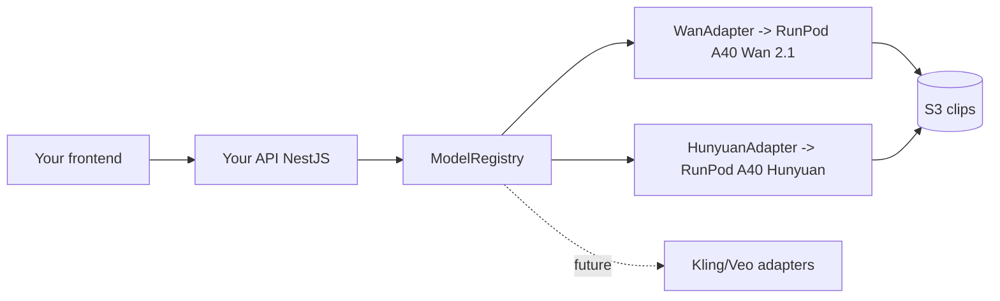

# 22 — Video Models & the "Own API" Strategy

This is the cost/strategy core of Cineforge: **run open-source video models on
your own RunPod GPUs and expose your own API on top**, instead of paying
per-generation fees to Runway/Kling/Pika/Luma.

## Models

| Role | Model | Where it runs | Tiers | Why |
|------|-------|---------------|-------|-----|
| **Primary** | **Wan 2.1** | RunPod **A40 48GB** GPU worker | all tiers | Strong quality at the lowest GPU-seconds; the default for every film |
| **Premium** | **Hunyuan Video** | RunPod **A40 48GB** GPU worker | Studio/Enterprise | Higher fidelity for paid tiers; ~2× GPU cost |
| Future | Kling, Veo, CogVideoX, … | external API or self-hosted | configurable | Plug in via an adapter, no app changes |

## Why self-host (the cost thesis)
- **No per-generation API fees.** You pay only for **GPU-seconds** on RunPod,
  which scale to zero when idle ([12](12-runpod-gpu.md)).
- **You own the pricing.** Bill users in `creditsMs` (GPU-ms); margin =
  subscription − GPU/audio/storage cost ([15](15-monetization.md)).
- **Capability parity with Runway/Kling/Pika/Luma** for the core
  text/image→video task, while keeping the unit economics under your control.
- **No vendor lock-in or rate limits** dictated by a third party.

## "Build your own API on top"
The whole platform **is** your API. Models are never called directly by the
frontend — they sit behind:

1. `packages/model-adapters` — the `VideoModelAdapter` interface + `WanAdapter`
   / `HunyuanAdapter` (both proxy to a RunPod A40 worker via `RunpodClient`).
2. `ModelRegistry` — resolve a model by `id`; `GET /models` lists capabilities.
3. Your REST/WS API ([04](04-api-spec.md)) — `/generate-film`,
   `/generate-scene`, `/render`, streaming, billing — none of which expose the
   underlying model vendor.

Adding a model later = one adapter + `registry.register(...)`. **Frontend and
API contracts don't change** (`modelId` is just a string the UI lists).

## RunPod A40 48GB fit
- 48GB VRAM comfortably hosts Wan 2.1 and Hunyuan with headroom for reference
  conditioning and batching.
- Model weights baked into the image / network volume; loaded once and kept
  warm; scale-to-zero on idle ([12](12-runpod-gpu.md)).

## Code references
- Interface: `packages/model-adapters/src/types.ts`
- RunPod client: `packages/model-adapters/src/runpod-client.ts`
- Wan 2.1: `packages/model-adapters/src/wan/wan.adapter.ts`
- Hunyuan: `packages/model-adapters/src/hunyuan/hunyuan.adapter.ts`
- Registry (defaults to Wan + Hunyuan): `packages/model-adapters/src/registry.ts`
- GPU worker service: `apps/gpu-worker/`
