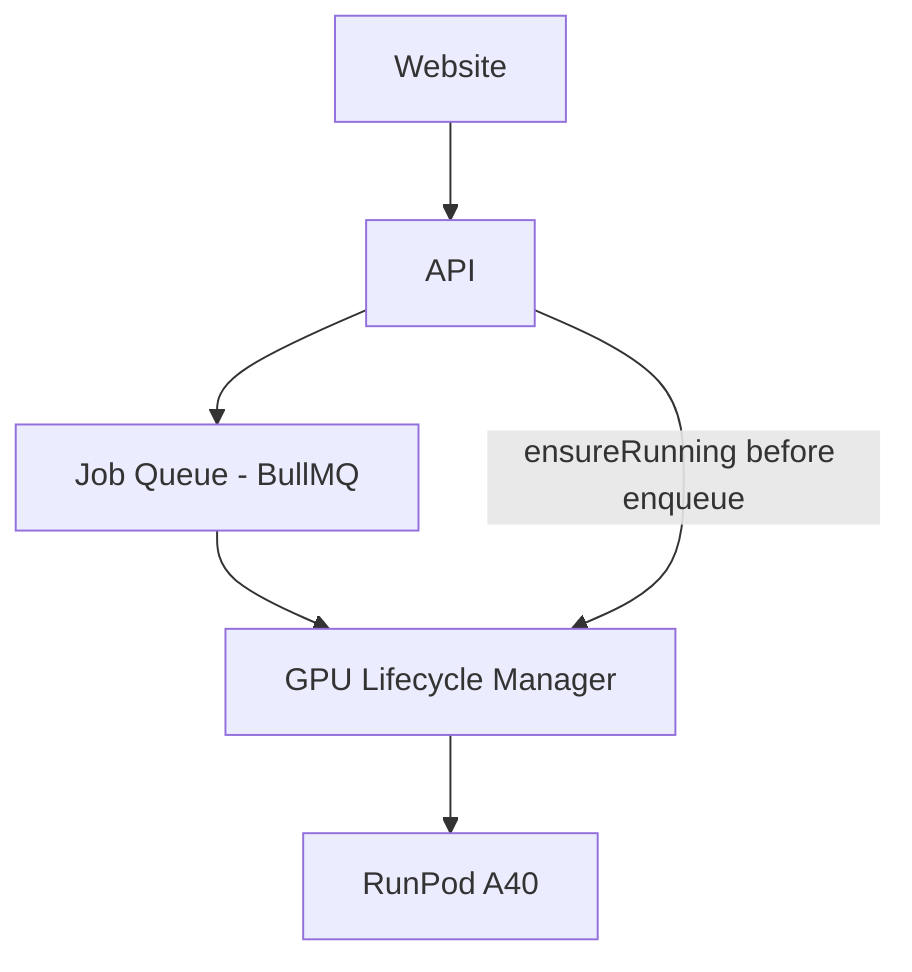
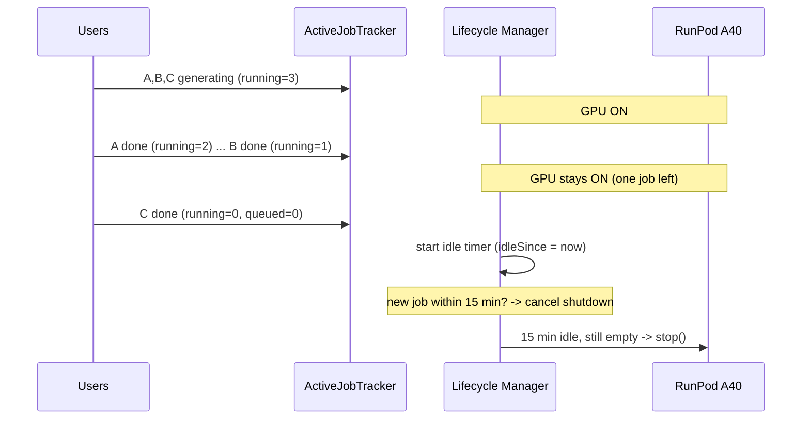

# 23 — Auto GPU Lifecycle Manager (Phase 1)

> **The single biggest cost lever for a startup — 70–95% GPU savings.** This is
> part of the architecture from **Phase 1**, not a later optimization.

The GPU costs money only while it generates. The Lifecycle Manager starts the
RunPod A40 **on demand** when a job is submitted, keeps it alive while **any**
user's generation is in flight, and shuts it down automatically **after the very
last generation completes** and a grace period passes — even if 100 users are
still online.

## The change

Instead of:
```
GPU starts → user generates → video completes → GPU keeps running → money burns
```
You get:
```
user generates → GPU starts automatically → generate → no active jobs
→ grace period → GPU shuts down automatically
```

## Where it sits


## The shutdown predicate (reference-counted across ALL users)
```
ACTIVE_JOBS == 0          (nothing generating on a GPU right now)
AND QUEUED_JOBS == 0      (nothing waiting/delayed/pending)
AND IDLE_TIME >= 15 min   (grace period since the queue went empty)
        ⇒ stopRunPod()
```
Because counts aggregate **every user's jobs**, the GPU stays up as long as one
generation remains. It only stops after the last one finishes and no new job
arrives during the grace window.

## Components (code)
| Piece | File | Role |
|-------|------|------|
| **ActiveJobTracker** | `apps/worker/src/gpu/active-job-tracker.ts` | The active-job counter. Source of truth = BullMQ queue state across all GPU queues (video + GPU-audio), so it's correct across all users **and** all server nodes. |
| **RunpodControlClient** | `apps/worker/src/gpu/runpod-control.ts` | Starts/stops the RunPod pod or serverless endpoint; health-checks the worker. |
| **GpuLifecycleManager** | `apps/worker/src/gpu/lifecycle-manager.ts` | Orchestrates start-on-demand + grace-period shutdown; Redis-coordinated for multi-node safety. |

### Active Job Counter
```jsonc
// ActiveJobTracker.counts()  — aggregated across all users
{ "queued": 2, "running": 1, "pending": 0, "total": 3 }   // GPU stays ON
```

## Start logic (on submit)
The API calls `ensureRunning()` **before** enqueuing — the job only runs once
the GPU is healthy:
```ts
// apps/api/src/films/films.service.ts (generate path)
await gpuManager.ensureRunning();          // start GPU + wait until /health ok
await videoQueue.add("shot", videoJob);    // then push the job
```
`ensureRunning()` is idempotent and lock-guarded: 50 concurrent submissions
start the GPU **once**, and it clears any pending shutdown immediately.

## Multi-user scenario (why it's safe)


## Reconcile loop (the driver + safety net)
`GpuLifecycleManager.startLoop()` runs every ~30s (and can be triggered on
BullMQ `drained` events) and applies the predicate:
- `total > 0` → clear the idle timer, stay up.
- `total == 0` → set `idleSince` (once), and when `now - idleSince >= grace`,
  acquire the Redis lock, **re-check counts under the lock** (a job may have
  just arrived), and stop the GPU.

It's also a safety net: if a worker crashed leaving the GPU orphaned, the loop
reconciles it to STOPPED once the queue is empty.

## Grace period
Never shut down instantly — default **15 min** (`GPU_IDLE_GRACE_SEC`, also
supports 10 min). A new job during grace cancels the shutdown (`idleSince`
deleted in `ensureRunning`).

## Why this matters (cost)
| Mode | GPU hours/day | A40 @ ~$0.45/hr | Monthly |
|------|---------------|------------------|---------|
| Always-on | 24 | $10.80/day | **~$324** (even with zero users) |
| Auto lifecycle | ~3 (real usage) | $1.35/day | **~$40** |

≈ **88% saving** at this usage; 70–95% typical for early-stage traffic.

## Phase 3 — GPU pool (scale-out)
The same manager generalizes to a pool. Track jobs + utilization + queue size:
```
queue depth > 10 jobs        → start another GPU
a GPU idle (its share == 0) for 15 min → stop that excess GPU
```
The reference-counted shutdown rule is applied **per GPU**; the last GPU follows
the exact predicate above. This is the `autoscaler.ts` evolution referenced in
[12-runpod-gpu.md](12-runpod-gpu.md).

## Configuration (`.env`)
```
RUNPOD_API_KEY=...
RUNPOD_WAN_POD_ID=...          # or RUNPOD_WAN_ENDPOINT_ID (serverless)
RUNPOD_HUNYUAN_POD_ID=...
GPU_IDLE_GRACE_SEC=900         # 15 min
GPU_RECONCILE_SEC=30
```

## Implementation checklist
- [ ] `ActiveJobTracker` over video + GPU-audio queues
- [ ] `RunpodControlClient` start/stop (pods **and** serverless) + health wait
- [ ] `GpuLifecycleManager` with Redis state/idle/lock + reconcile loop
- [ ] `ensureRunning()` called in the API generate path before enqueue
- [ ] One manager per model pool (Wan, Hunyuan)
- [ ] Trigger reconcile on BullMQ `drained` in addition to the interval
- [ ] Admin GPU panel shows `status()` (state, idleSince, counts)
- [ ] Alert if GPU RUNNING while `total == 0` beyond grace (stuck stop)
